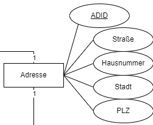

# Services

## In this repository you can find the services of the InfinityApplication

### person-service

[Rendered version of person-service api can be found here.](https://infinityapplication.github.io/services/?urls.primaryName=person-service%20API)

[The openapi file can be found here.](https://github.com/InfinityApplication/services/blob/master/person-service/api/person-service.openapi.yaml)

### address-service

[Rendered version of address-service api can be found here.](https://infinityapplication.github.io/services/?urls.primaryName=address-service%20API)

[The openapi file can be found here.](https://github.com/InfinityApplication/services/blob/master/address-service/api/address-service.openapi.yaml)

